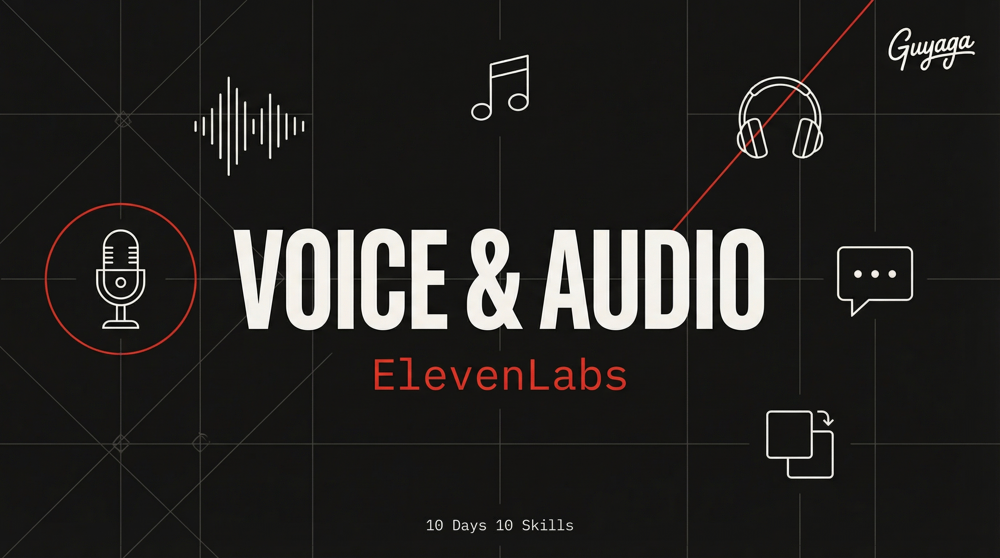

<p align="center">
  
</p>

<h1 align="center">Day 4 — AI Voice & Audio</h1>
<p align="center">
  <strong>10 Days 10 Skills</strong> · Claude Code Course by <a href="https://bestguy.ai">Guy Aga</a>
</p>
<p align="center">
  
  
  
</p>

---

## What is This?

This skill lets you **generate professional voiceovers, music, and sound effects** directly from Claude Code using ElevenLabs. Type what you want to say, pick a voice (or clone your own), and get studio-quality audio in seconds.

### What Can You Do With It?

| You Say | What Happens |
|---------|-------------|
| "Narrate this script with a warm male voice" | Professional voiceover in MP3 |
| "Clone my voice from this recording" | Your voice, reading anything you type |
| "Create background music for a tech video" | Custom AI-generated track |
| "Generate a notification sound" | UI sound effect ready to use |
| "Add voiceover to my video" | Narration generated + mixed into video (with Day 3 skill) |

### Why ElevenLabs?

| Feature | What It Means |
|---------|---------------|
| **V3 Model** | Most natural AI voice ever — barely distinguishable from real speech |
| **Voice Cloning** | Record 1 minute of your voice → AI speaks anything in YOUR voice |
| **32+ Languages** | Same voice, different language — Hebrew, English, Spanish, anything |
| **Music + SFX** | Not just voices — generate background music and sound effects too |
| **Emotion control** | Adjust stability, style, speed — make it dramatic, calm, or energetic |

---

## Prerequisites

- [ ] **Claude Code** (Pro or Max subscription)
- [ ] **ElevenLabs account** (free tier available)
- [ ] **ElevenLabs API Key**

> **This skill requires a separate API key** from ElevenLabs (not the same Gemini key from Days 1-2). Free tier gives ~10,000 characters/month — enough for this lesson.

---

## Step 1: Create an ElevenLabs Account

1. Go to [elevenlabs.io](https://elevenlabs.io)
2. Click **Sign Up** (Google or email)
3. Free tier is enough to start

---

## Step 2: Get Your API Key

1. After signing in, click your **profile icon** (bottom-left)
2. Click **Profile + API key**
3. Click **Create API Key**
4. Copy the key

---

## Step 3: Set Your API Key

```bash
# Windows (PowerShell)
$env:ELEVEN_API_KEY="your-api-key-here"

# macOS / Linux
export ELEVEN_API_KEY=your-api-key-here
```

---

## Step 4: Install the Skill

### The Easy Way (Recommended)

Open Claude Code and paste:

```
Install the ai-voice-audio skill from https://github.com/guyaga/10d10s-day04-voice-audio and help me set up my ElevenLabs API key for generating voice, music, and sound effects.
```

### Manual Way

```bash
cd ~/.claude/skills/
git clone https://github.com/guyaga/10d10s-day04-voice-audio ai-voice-audio
```

---

## How to Use It

### Generate a Voiceover

```
Generate a voiceover saying "Welcome to our AI-powered marketing platform. 
In this video, we'll show you how to 10x your content production." 
Use a warm, professional male voice. Save to D:/Audio/narration.mp3
```

### Clone Your Voice

```
Clone my voice from this recording: D:/Audio/my-voice-sample.mp3
Then use the cloned voice to narrate: "This is my brand voice, generated by AI."
```

> **Tip:** Record at least 1 minute of clear speech in a quiet room. The better the sample, the better the clone.

### Generate Background Music

```
Generate 30 seconds of calm lo-fi hip hop music for a YouTube video intro.
Save to D:/Audio/background.mp3
```

### Create Sound Effects

```
Generate a modern app notification chime sound, 2 seconds long.
Save to D:/Audio/notification.mp3
```

### Add Narration to Video (Day 3 + Day 4)

```
Generate a voiceover for this script, then add it to D:/Videos/product-demo.mp4:
"Introducing the future of content creation. One tool. Infinite possibilities."
```

---

## Voice Cloning Tips

For the best clone quality:

1. **1-3 minutes** of clear speech (minimum 30 seconds)
2. **Good microphone** — even a phone in a quiet room works
3. **No background noise** — turn off AC, fans, TV
4. **Speak naturally** — don't read like a robot
5. **Upload multiple samples** for better results
6. **Use similarity_boost 0.85** for cloned voices

---

## Pricing Quick Guide

| Plan | Price | Characters/Month | Voice Clones |
|------|-------|-------------------|-------------|
| Free | $0 | ~10,000 | 1 instant clone |
| Starter | $5/mo | 30,000 | 3 instant clones |
| Creator | $22/mo | 100,000 | 10 clones |

> **10,000 characters ≈ 5-7 minutes of speech.** Enough for several narrations.

---

## Works Great With Other Skills

| Skill | How They Work Together |
|-------|----------------------|
| **Day 3: Video Editor** | Generate narration → add to video with ffmpeg |
| **Day 2: Video Analyzer** | Transcribe existing video → regenerate narration in a different voice |
| **Day 1: Image Generation** | Generate audio + visuals for a complete content package |

---

## Troubleshooting

| Problem | Solution |
|---------|----------|
| "API key not found" | Set `ELEVEN_API_KEY` in your terminal |
| "Quota exceeded" | Check credits at elevenlabs.io. Free tier resets monthly |
| Voice sounds robotic | Use `eleven_v3` model and adjust stability lower (0.3-0.5) |
| Clone doesn't sound like me | Record a longer sample (2+ minutes), in a quiet room |
| Audio too fast/slow | Adjust `speed` setting (0.7-1.2) |

---

## Links

- [ElevenLabs — Sign Up](https://elevenlabs.io)
- [ElevenLabs API Docs](https://elevenlabs.io/docs/api-reference)
- [ElevenLabs Pricing](https://elevenlabs.io/pricing)
- [Course Page — bestguy.ai](https://bestguy.ai/course/10-days-10-skills)
- [HTML Skill Guide (Hebrew)](https://bestguy.ai/course/guides/day04-voice-audio.html)

---

<p align="center">
  <strong>10 Days 10 Skills</strong> — Claude Code Course<br>
  <a href="https://bestguy.ai">bestguy.ai</a> · Guy Aga © 2026
</p>
